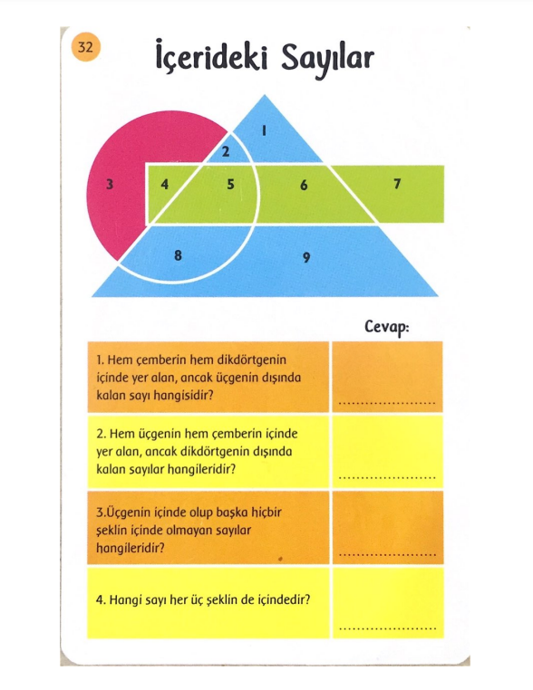

# Geometrili Bulmaca

Bu proje, Samet Can Söylemez tarafından Fırat Üniversitesi Yazılım Mühendisliği Güncel Konular dersi vizesi için geliştirilen bir proje mobil oyunudur. Oyunun adı 'Geometrili Bulmaca' olarak belirlenmiştir ve 'Mobil' platformda çalışmaktadır.

## Kullandığım Programlar ve Diller

* Unity
* Visual Studio 2019
* C#

## Proje Konusu Olan Kart

 

## Oyunun Amacı
* İç içe geçmiş şekillere göre verilen soruları cevaplama
* Cevapları doğrulayabilme
* Cevapları kontrol etme

## Oyunun Özellikleri
* Görsel zeka geliştirme
* Okuduğunu anlayabilme
* Sade tasarım
* Hitap edilen kitleye uygunluk
* Kullanım kolaylığı

## Apk Dosyası

## Oyun İçi Görseller
